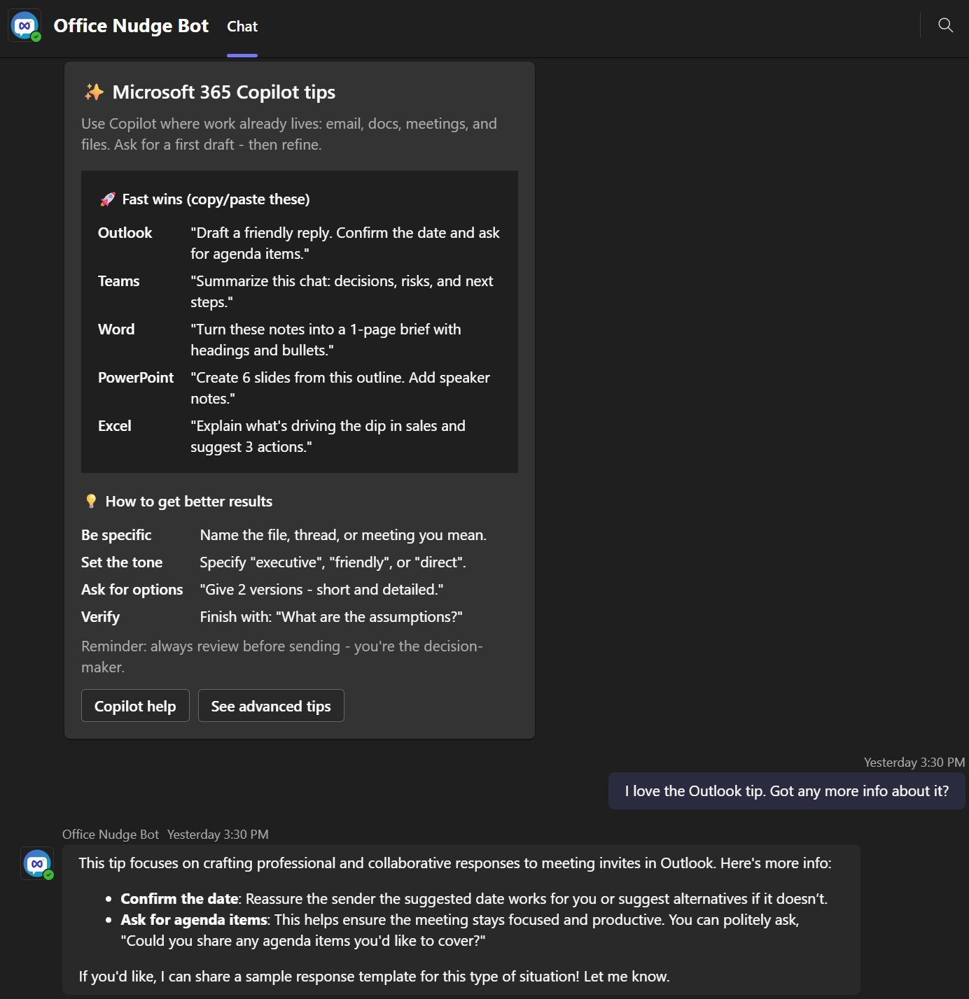

# Office Nudge Bot

**Drive Microsoft 365 Copilot adoption with targeted, in-context tips delivered directly in Microsoft Teams.**

Office Nudge is a Teams bot that sends beautifully designed adaptive cards with Copilot tips, prompt examples, and best practices to help your users get the most out of Microsoft 365 Copilot and Copilot Chat. Perfect for IT teams and adoption specialists looking to accelerate Copilot ROI.



## What is Office Nudge?

Office Nudge is a Microsoft Teams bot designed to **accelerate Microsoft 365 Copilot adoption** across your organization. It delivers timely, contextual tips and prompts directly to users in Teams, helping them discover and master Copilot capabilities in Outlook, Word, Excel, PowerPoint, and Teams itself.

Instead of relying on lengthy training sessions or emails that go unread, Office Nudge meets users where they work-right in Microsoft Teams-with bite-sized, actionable guidance that drives real behavior change.

### Key Use Cases

#### Copilot Adoption (Primary Focus)

- **Copilot Chat Tips** - Teach users how to get the most from Microsoft 365 Copilot Chat with ready-to-use prompts and best practices
- **App-Specific Copilot Guidance** - Share contextual tips for using Copilot in Outlook, Word, Excel, PowerPoint, and Teams
- **Prompt Engineering** - Help users craft better prompts with examples like "Be specific", "Set the tone", and "Ask for options"
- **Copilot Discovery** - Introduce new Copilot features and capabilities as they're released
- **Adoption Campaigns** - Run structured campaigns to drive Copilot usage with progressive tips over time

#### Additional Scenarios

- **Employee Onboarding** - Deliver welcome messages and Copilot getting-started resources to new team members
- **Training Reinforcement** - Send follow-up nudges after Copilot training sessions to reinforce learning
- **Feature Announcements** - Notify users about new Microsoft 365 features and how Copilot can help
- **Feedback Collection** - Gather user feedback on Copilot adoption through interactive cards

### Why Use Office Nudge?

| Traditional Email | Office Nudge Bot |
|------------------|------------------|
| Often ignored or filtered | Appears directly in Teams chat |
| Static content | Interactive adaptive cards |
| No engagement tracking | Full delivery and interaction logging |
| One-size-fits-all | Targeted to specific users or groups |
| Manual sending | Scheduled and automated delivery |

## Features

- **Template Management** - Create and edit adaptive card templates with JSON payloads
- **Azure Storage Only** - Lightweight solution using Azure Table Storage for metadata and Blob Storage for JSON payloads (no SQL database required)
- **Teams Bot Integration** - Deliver adaptive cards directly to users via Teams bot conversations
- **Message Logging** - Track message delivery status and recipients
- **Authentication** - Supports both Teams SSO and MSAL authentication
- **Modern UI** - React-based web interface with Fluent UI components
- **Scalable Storage** - Blob storage handles large JSON payloads (no 64KB table storage limit)
- **No Database Required** - Pure Azure Storage solution for minimal infrastructure overhead
- **AI-Powered Conversations** - Optional Azure AI Foundry integration for intelligent bot responses


## Technology Stack

### Backend
- **.NET 10**: Modern C# application framework
- **ASP.NET Core**: Web API and hosting
- **Azure Table Storage**: Metadata and reference storage (lightweight, no SQL database required)
- **Azure Blob Storage**: JSON payload storage (unlimited size)
- **Microsoft Bot Framework**: Teams bot integration
- **Microsoft Graph API**: User and Teams data access

### Frontend
- **React 18**: Modern UI library
- **TypeScript**: Type-safe JavaScript
- **Fluent UI**: Microsoft's design system
- **Vite**: Fast build tool
- **Azure MSAL**: Authentication library
- **Teams JS SDK**: Teams integration

## Prerequisites

For development, you will need:
- [.NET 10 SDK](https://dotnet.microsoft.com/download/dotnet/10.0)
- [Node.js 18+](https://nodejs.org/)
- [Azure Subscription](https://azure.microsoft.com/free/)
- [Microsoft 365 tenant](https://developer.microsoft.com/microsoft-365/dev-program) with Teams

For complete prerequisites and Azure resource requirements, see the [Deployment Guide](DEPLOYMENT.md).

## Project Structure

The solution is located in the `src/Full` directory:

| Project | Description |
|---------|-------------|
| `Web.Server` | ASP.NET Core Web API and Teams bot |
| `Common.Engine` | Core business logic and services |
| `Common.DataUtils` | Data access and storage utilities |
| `UnitTests` | Unit test project |

## Teams Bot Setup

This section covers creating a Teams bot, configuring the required Microsoft Graph permissions, and setting up the bot messaging endpoint.

### 1. Create a Bot in Teams Developer Portal

1. Navigate to the [Teams Developer Portal](https://dev.teams.microsoft.com/)
2. Sign in with your Microsoft 365 account
3. Go to **Tools** ? **Bot management** in the left navigation
4. Click **+ New Bot**
5. Enter a name for your bot (e.g., "Office Nudge Bot")
6. Click **Add**
7. Once created, note down the **Bot ID** - this is your `MicrosoftAppId`
8. Click on your newly created bot to open its settings
9. Under **Client secrets**, click **Add a client secret**
10. Copy and securely store the generated secret - this is your `MicrosoftAppPassword`

> ?? **Important**: The client secret is only shown once. Store it securely immediately.

### 2. Configure Graph Permissions for the Bot's Entra ID App

When you create a bot in the Teams Developer Portal, an Entra ID (Azure AD) app registration is automatically created. You need to add the required Microsoft Graph permissions to this app.

1. Go to the [Azure Portal](https://portal.azure.com/)
2. Navigate to **Microsoft Entra ID** ? **App registrations**
3. Search for your bot by name or Bot ID (the app will have the same name as your bot)
4. Click on the app registration to open it
5. Go to **API permissions** in the left menu
6. Click **+ Add a permission**
7. Select **Microsoft Graph** ? **Application permissions**
8. Add the following permissions:
   - `User.Read.All` - Required for reading user information and statistics
   - `TeamsActivity.Send` - Required for sending activity feed notifications
   - `TeamsAppInstallation.ReadWriteForUser.All` - Required for the bot to install itself to user conversations and send messages

9. After adding all permissions, click **Grant admin consent for [Your Tenant]**
10. Confirm by clicking **Yes**

> ?? **Note**: All Application permissions require admin consent. Without granting admin consent, the bot will not be able to send messages or access user information.

#### Verifying Permissions

After granting consent, your API permissions should show a green checkmark next to each permission indicating "Granted for [Your Tenant]".

| Permission | Type | Description |
|------------|------|-------------|
| `User.Read.All` | Application | Read all users' full profiles |
| `TeamsActivity.Send` | Application | Send activity feed notifications |
| `TeamsAppInstallation.ReadWriteForUser.All` | Application | Manage Teams app installations for users |

### 3. Configure Bot Messaging Endpoint (After Deployment)

Once your application is deployed to Azure App Service, you need to configure the bot's messaging endpoint so Teams knows where to send messages.

1. Deploy your application to Azure App Service (see [Deployment](#deployment) section)
2. Note your App Service URL (e.g., `https://your-app-name.azurewebsites.net`)
3. Go back to the [Teams Developer Portal](https://dev.teams.microsoft.com/)
4. Navigate to **Tools** ? **Bot management**
5. Click on your bot to open its settings
6. Under **Configure** ? **Endpoint address**, enter:
   ```
   https://your-app-name.azurewebsites.net/api/messages
   ```
7. Click **Save**

> ?? **Tip**: The messaging endpoint must be HTTPS and publicly accessible. Azure App Service provides this by default.

#### Testing the Bot Connection

After configuring the endpoint:
1. Open Microsoft Teams
2. Search for your bot by name in the search bar
3. Start a conversation with the bot
4. The bot should respond, confirming the connection is working

If the bot doesn't respond:
- Verify the endpoint URL is correct
- Check that the App Service is running
- Review Application Insights logs for errors
- Ensure `MicrosoftAppId` and `MicrosoftAppPassword` are correctly configured in your App Service settings

## Configuration

This section covers configuring the application for local development and production. Before proceeding, ensure you have completed the [Teams Bot Setup](#teams-bot-setup) section to create your bot and configure the required permissions.

> :memo: **Note**: When you create a bot in the Teams Developer Portal, an Entra ID (Azure AD) app registration is automatically created. This same app registration is used for both the bot identity and Microsoft Graph API access. You will use the Bot ID as your `MicrosoftAppId` / `GraphConfig:ClientId` and the bot client secret as your `MicrosoftAppPassword` / `GraphConfig:ClientSecret`.

### 1. Backend Configuration (User Secrets)

**?? Important**: For local development, use **User Secrets** to store sensitive configuration. Never commit secrets to source control.

#### Setting Up User Secrets

Navigate to the Web.Server project directory and initialize user secrets:

```bash
cd Web/Web.Server
dotnet user-secrets init
```

Then add your configuration values:

```bash
# Graph API Configuration (Required)
dotnet user-secrets set "GraphConfig:ClientId" "your-app-registration-client-id"
dotnet user-secrets set "GraphConfig:ClientSecret" "your-app-registration-client-secret"
dotnet user-secrets set "GraphConfig:TenantId" "your-tenant-id"
dotnet user-secrets set "GraphConfig:Authority" "https://login.microsoftonline.com/organizations"

# Web Auth Configuration (Required)
dotnet user-secrets set "WebAuthConfig:ClientId" "your-web-app-registration-client-id"
dotnet user-secrets set "WebAuthConfig:ClientSecret" "your-web-app-registration-client-secret"
dotnet user-secrets set "WebAuthConfig:TenantId" "your-tenant-id"
dotnet user-secrets set "WebAuthConfig:Authority" "https://login.microsoftonline.com/organizations"

# Storage Connection (Required)
dotnet user-secrets set "ConnectionStrings:Storage" "DefaultEndpointsProtocol=https;AccountName=yourstorageaccount;AccountKey=your-storage-key;EndpointSuffix=core.windows.net"

# Bot Configuration (Required)
dotnet user-secrets set "MicrosoftAppId" "your-bot-app-id"
dotnet user-secrets set "MicrosoftAppPassword" "your-bot-app-password"

# Teams App Catalog ID (Optional)
dotnet user-secrets set "AppCatalogTeamAppId" "your-teams-app-catalog-id"

# AI Foundry Configuration (Optional - for Copilot Connected mode)
dotnet user-secrets set "AIFoundryConfig:Endpoint" "https://your-project.openai.azure.com/"
dotnet user-secrets set "AIFoundryConfig:DeploymentName" "your-deployment-name"
dotnet user-secrets set "AIFoundryConfig:ApiKey" "your-api-key"
dotnet user-secrets set "AIFoundryConfig:MaxTokens" "2000"
dotnet user-secrets set "AIFoundryConfig:Temperature" "0.7"

# Application Insights (Optional)
dotnet user-secrets set "APPLICATIONINSIGHTS_CONNECTION_STRING" "InstrumentationKey=your-key;IngestionEndpoint=https://..."

# Development Settings (Optional)
dotnet user-secrets set "DevMode" "true"
dotnet user-secrets set "TestUPN" "your-test-user@yourtenant.onmicrosoft.com"
```

#### Configuration Structure Reference

Your secrets will follow this structure (stored securely outside your project directory):

```json
{
  "GraphConfig": {
    "ClientId": "your-app-registration-client-id",
    "ClientSecret": "your-app-registration-client-secret",
    "TenantId": "your-tenant-id",
    "Authority": "https://login.microsoftonline.com/organizations",
    "ApiAudience": "optional-api-audience"
  },
  "WebAuthConfig": {
    "ClientId": "your-web-app-registration-client-id",
    "ClientSecret": "your-web-app-registration-client-secret",
    "TenantId": "your-tenant-id",
    "Authority": "https://login.microsoftonline.com/organizations",
    "ApiAudience": "optional-api-audience"
  },
  "ConnectionStrings": {
    "Storage": "UseDevelopmentStorage=true"
  },
  "MicrosoftAppId": "your-bot-app-id",
  "MicrosoftAppPassword": "your-bot-app-password",
  "AppCatalogTeamAppId": "your-teams-app-catalog-id",
  "AIFoundryConfig": {
    "Endpoint": "https://your-project.openai.azure.com/",
    "DeploymentName": "your-deployment-name",
    "ApiKey": "your-api-key",
    "MaxTokens": 2000,
    "Temperature": "0.7"
  },
  "APPLICATIONINSIGHTS_CONNECTION_STRING": "InstrumentationKey=your-key;IngestionEndpoint=https://...",
  "DevMode": true,
  "TestUPN": "your-test-user@yourtenant.onmicrosoft.com"
}
```

#### Configuration Details

**Required Settings:**

- **GraphConfig**: Azure AD configuration for Microsoft Graph API access
  - `ClientId`: Your app registration client ID
  - `ClientSecret`: Your app registration client secret
  - `TenantId`: Your Azure AD tenant ID
  - `Authority`: OAuth authority URL (defaults to organizations)
  - `ApiAudience`: (Optional) API audience for token validation

- **WebAuthConfig**: Azure AD configuration for web interface authentication
  - Uses same structure as GraphConfig
  - Required for user authentication to the web portal

- **ConnectionStrings.Storage**: Azure Storage connection string for table and blob storage

- **MicrosoftAppId**: Bot application ID (same as GraphConfig.ClientId)

- **MicrosoftAppPassword**: Bot application secret (same as GraphConfig.ClientSecret)

**Optional Settings:**

- **AppCatalogTeamAppId**: Teams app catalog ID for the bot

- **AIFoundryConfig**: Azure AI Foundry configuration for Copilot Connected mode (enables smart groups and AI-powered conversations)
  - `Endpoint`: Azure AI Foundry endpoint URL
  - `DeploymentName`: AI model deployment name
  - `ApiKey`: API key for authentication
  - `MaxTokens`: Maximum tokens for AI responses (default: 2000)
  - `Temperature`: Temperature for AI responses 0.0-1.0 (default: 0.7)

- **APPLICATIONINSIGHTS_CONNECTION_STRING**: Application Insights connection string for telemetry

- **DevMode**: Enable development mode features (default: false)

- **TestUPN**: Test user principal name for development testing

### 3. Frontend Configuration

Create `Web/web.client/.env.local`:

```env
VITE_MSAL_CLIENT_ID=your-app-registration-client-id
VITE_MSAL_AUTHORITY=https://login.microsoftonline.com/your-tenant-id
VITE_MSAL_SCOPES=api://your-app-registration-client-id/access_as_user
VITE_TEAMSFX_START_LOGIN_PAGE_URL=https://your-domain.com/auth-start.html
```

### 4. Production Configuration

For production deployments to Azure App Service:

1. **Azure App Service**: Configure application settings in the Azure Portal under Configuration ? Application Settings
2. **Azure Key Vault**: For enhanced security, store secrets in Azure Key Vault and reference them in your application settings:
   ```
   @Microsoft.KeyVault(SecretUri=https://your-keyvault.vault.azure.net/secrets/StorageConnectionString/)
   ```
3. **Managed Identity**: Use system-assigned or user-assigned managed identities to access Azure resources without storing credentials

## Installation & Setup

### 1. Clone the Repository

```bash
git clone https://github.com/sambetts/office-nudge.git
cd office-nudge/src/Full
```

### 2. Restore Backend Dependencies

```bash
dotnet restore
```

### 3. Install Frontend Dependencies

```bash
cd Web/web.client
npm install
cd ../..
```

### 4. Build the Solution

```bash
dotnet build
```

### 5. Build the Frontend

```bash
cd Web/web.client
npm run build
cd ../..
```

## Running the Application

### Development Mode

**Backend:**
```bash
cd Web/Web.Server
dotnet run
```

The API will be available at `https://localhost:5001` (or configured port)

**Frontend:**
```bash
cd Web/web.client
npm run dev
```

The React app will be available at `http://localhost:5173`

### Production Mode

Build and run the backend (frontend is served from backend):

```bash
cd Web/Web.Server
dotnet publish -c Release -o ./publish
cd publish
dotnet Web.Server.dll
```

## Usage

### Managing Adaptive Card Templates

1. **Access the Application**: Navigate to the web application and authenticate
2. **Navigate to Templates**: Go to the "Message Templates" page
3. **Create a Template**:
   - Click "New Template"
   - Enter a template name
   - Paste your adaptive card JSON payload
   - Click "Create"

**Example Adaptive Card JSON:**

```json
{
  "type": "AdaptiveCard",
  "version": "1.3",
  "body": [
    {
      "type": "TextBlock",
      "text": "Welcome Message",
      "size": "Large",
      "weight": "Bolder"
    },
    {
      "type": "TextBlock",
      "text": "This is a sample adaptive card that can be sent to Teams users.",
      "wrap": true
    },
    {
      "type": "ActionSet",
      "actions": [
        {
          "type": "Action.OpenUrl",
          "title": "Learn More",
          "url": "https://adaptivecards.io/"
        }
      ]
    }
  ]
}
```

4. **Edit/Delete Templates**: Use the action buttons in the templates table
5. **View Template**: Click the eye icon to preview the JSON

### Sending Messages to Users

Messages can be sent via the Teams bot using the stored templates. The bot will:
1. Retrieve the template metadata from Azure Table Storage
2. Download the JSON payload from Azure Blob Storage
3. Parse the adaptive card JSON
4. Send the card to specified users or channels
5. Log the delivery status

**Storage Details:**
- Template metadata (name, creator, dates) is stored in Azure Table Storage for fast queries
- JSON payloads are stored in Azure Blob Storage (`message-templates` container) to handle large adaptive cards
- Each template's blob is named `{templateId}.json`
- Table storage references the blob URL for retrieval

### Viewing Message Logs

Navigate to the message logs section to view:
- When messages were sent
- Which template was used
- Recipient information
- Delivery status (Sent, Failed, Pending)

## API Endpoints

### Message Template Management

- `GET /api/MessageTemplate/GetAll` - Get all templates
- `GET /api/MessageTemplate/Get/{id}` - Get specific template
- `GET /api/MessageTemplate/GetJson/{id}` - Get template JSON payload
- `POST /api/MessageTemplate/Create` - Create new template
- `PUT /api/MessageTemplate/Update/{id}` - Update template
- `DELETE /api/MessageTemplate/Delete/{id}` - Delete template

### Message Logging

- `POST /api/MessageTemplate/LogSend` - Log a message send event
- `GET /api/MessageTemplate/GetLogs` - Get all message logs
- `GET /api/MessageTemplate/GetLogsByTemplate/{templateId}` - Get logs for specific template

## Deployment

For complete deployment instructions, see the **[Deployment Guide](DEPLOYMENT.md)**.

### Quick Start

**Manual Deployment:**
```bash
cd src/Full
dotnet publish Web/Web.Server/Web.Server.csproj -c Release -o ./publish
az webapp deploy --resource-group myResourceGroup --name myAppName --src-path ./publish
```

**CI/CD Pipelines:**
This project includes pre-configured pipelines for automated deployment:

| Platform | File | Features |
|----------|------|----------|
| GitHub Actions | `.github/workflows/azure-deploy.yml` | Build, test, deploy with OIDC auth |
| Azure DevOps | `.azure-pipelines/azure-deploy.yml` | Multi-stage pipeline with service connection |

See [DEPLOYMENT.md](DEPLOYMENT.md) for detailed setup instructions including:
- Azure Key Vault integration
- Federated credentials setup (GitHub Actions)
- Service connection configuration (Azure DevOps)
- Post-deployment verification steps

## Security Considerations

- **Never commit secrets to source control** - Use user secrets for development, Key Vault for production
- **Use Azure Key Vault** to store all sensitive configuration values in production
- **Enable Managed Identity** for Azure resources to avoid storing credentials
- **Implement proper RBAC** for template management and Azure resource access
- **Validate all adaptive card JSON** before storage to prevent injection attacks
- **Use HTTPS only** for all communications
- **Regularly rotate secrets** - Client secrets, storage keys, and bot passwords
- **Enable Azure Storage firewall** rules to restrict access to trusted networks
- **Use SAS tokens** with limited permissions and expiration times when possible
- **Monitor and audit** access logs using Application Insights and Azure Monitor
- **Implement rate limiting** on API endpoints to prevent abuse

### Security Best Practices

1. **Development Environment**:
   - Use `dotnet user-secrets` for local development
   - Never use production credentials locally
   - Keep `.env.local` files out of version control (already in .gitignore)

2. **Production Environment**:
   - Store all secrets in Azure Key Vault
   - Use managed identities for Azure service authentication
   - Enable Azure AD authentication for storage accounts
   - Configure network security groups and firewall rules
   - Enable logging and monitoring for all resources

3. **Application Security**:
   - Validate and sanitize all user inputs
   - Implement proper authorization checks in controllers
   - Use CORS policies to restrict frontend access
   - Keep all NuGet packages and npm dependencies updated

## Troubleshooting

### Common Issues

**Authentication Errors:**
- Verify Azure AD app registration configuration
- Check redirect URIs match your deployment
- Ensure API permissions are granted (admin consent)

**Graph API Permission Errors:**
If you see errors like "Current authenticated context is not valid for this request" or "Insufficient privileges":
1. **Verify Application Permissions** in Azure Portal:
   - Go to Azure Active Directory ? App registrations ? Your app
   - Click **API permissions**
   - Ensure all required permissions are listed:
     - `User.Read.All` (Application)
     - `TeamsActivity.Send` (Application)
     - `TeamsAppInstallation.ReadWriteForUser.All` (Application)
2. **Grant Admin Consent**:
   - Click **Grant admin consent for [Your Tenant]**
   - Wait a few minutes for changes to propagate
3. **Verify Tenant ID**:
   - Ensure your `TenantId` in configuration doesn't have extra characters
   - Check `dotnet user-secrets list` to verify the value
4. **Test Graph Connection**:
   - Navigate to `/api/Diagnostics/TestGraphConnection` to verify connectivity
   - Check logs for detailed error messages

**Storage Connection Errors:**
- Verify storage account connection string
- Check storage account firewall rules
- Ensure storage account has both Table and Blob services enabled
- Verify the `message-templates` blob container exists or can be created

**Bot Not Responding:**
- Verify bot app registration and credentials
- Check bot is properly installed in Teams
- Ensure `TeamsAppInstallation.ReadWriteForUser.All` permission is granted
- Review Application Insights logs
